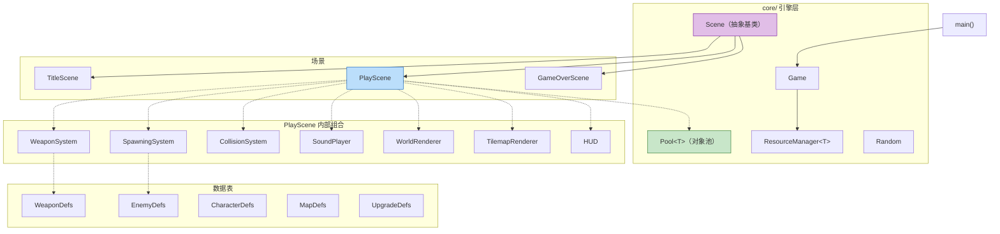
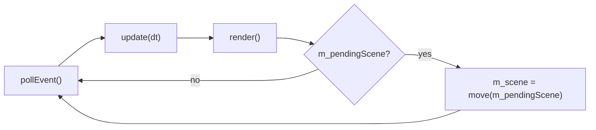
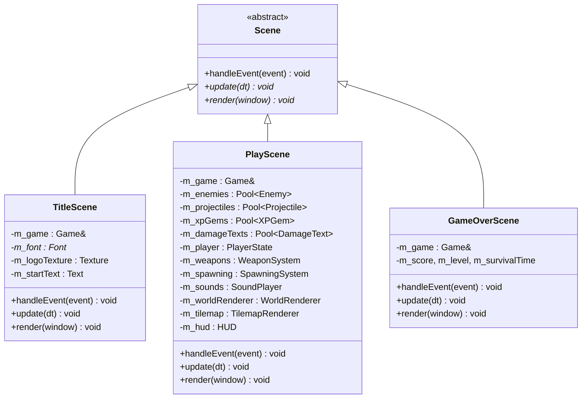
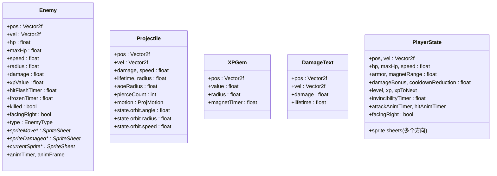
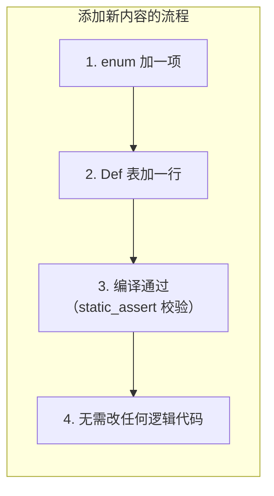
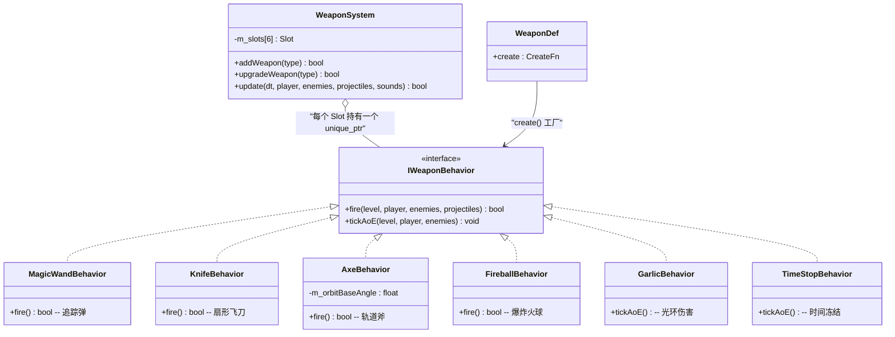
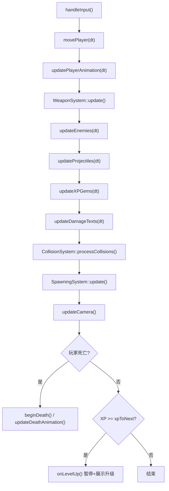
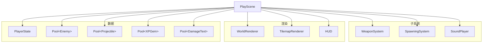
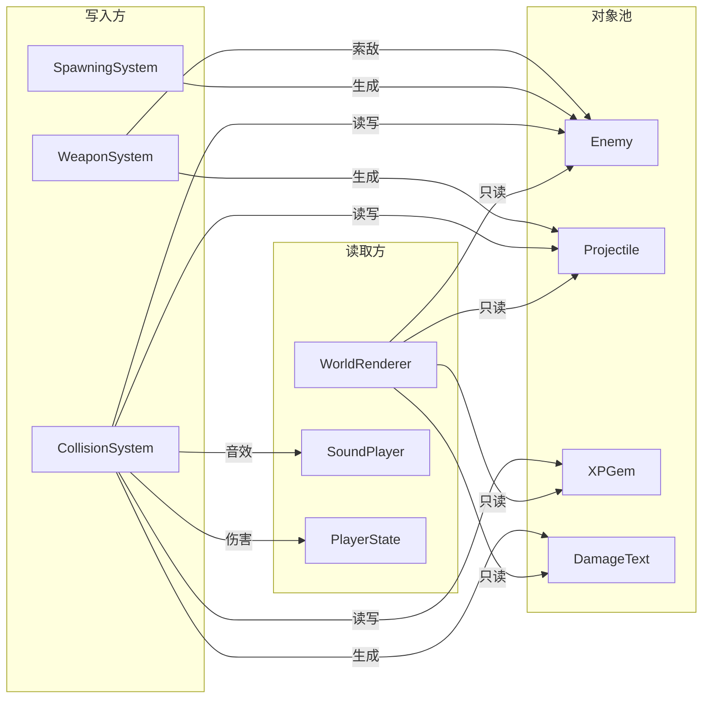
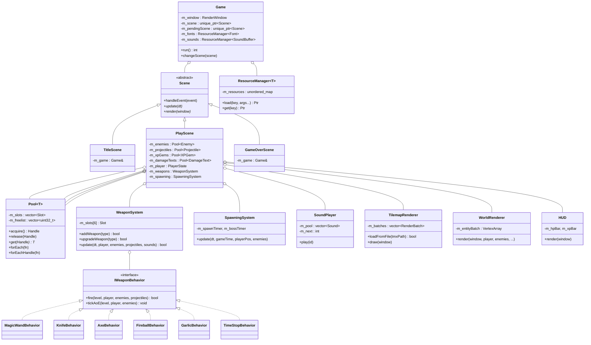

# 游戏类设计分析

> **核心设计哲学：组合优于继承，数据驱动逻辑，编译期优于运行时，显式优于隐式。**

## 一、总体架构概览

本项目采用 **组合优于继承** 的架构哲学，核心由三层组成：

- **`core/`** — 引擎通用层：主循环、场景抽象、对象池、资源管理
- **`gameplay/`** — 纯数据表：武器、敌人、角色、地图、升级的定义（无运行时逻辑）
- **`systems/`** — 运行时逻辑：武器系统、碰撞、生成、音频



---

## 二、核心引擎层 (`core/`)

### 2.1 `Game` — 游戏主循环

`Game` 是整个程序的**根对象**，负责生命周期管理。

```
Game
├── 窗口: sf::RenderWindow
├── 场景: unique_ptr<Scene> (当前) + unique_ptr<Scene> (待切换)
├── 资源: ResourceManager<sf::Font> + ResourceManager<sf::SoundBuffer>
└── 主循环: Fixed Timestep (60Hz 更新, 不限帧渲染)
```

**关键设计——延迟场景切换：**

```cpp
void changeScene(std::unique_ptr<Scene> scene); // 存入 m_pendingScene
// 实际切换在 run() 的循环末尾执行，因此在 update() 中调用也是安全的
```

这避免了在 `update()` 中切换场景导致当前栈帧的 `this` 失效的经典问题。

**主循环结构：**

> **"Fix Your Timestep"** -- Glenn Fiedler



固定 1/60s 时间步，单帧最多执行 4 次 update（防止死亡螺旋）。

### 2.2 `Scene` — 场景抽象基类



三个虚函数：

| 方法 | 纯虚 | 用途 |
|------|------|------|
| `handleEvent(const sf::Event&)` | 否 (默认空实现) | 输入处理 |
| `update(sf::Time)` | **是** | 逻辑更新 (60Hz) |
| `render(sf::RenderWindow&)` | **是** | 绘制 |

`PlayScene` 通过 **组合** 方式聚合所有子系统，而非继承。每个子系统是一个独立成员变量。

### 2.3 `Pool<T>` — 泛型对象池

这是整个游戏**最核心的内存管理基础设施**。

```
┌─────────────────────────────────────────────┐
│              Pool<T> 内部结构                │
├─────────────────────────────────────────────┤
│  m_slots: vector<Slot>                      │
│  ┌─────┬─────┬─────┬─────┬─────┐            │
│  │ T   │ T   │ T   │ T   │ T   │  ← 数据    │
│  │gen=3│gen=0│gen=1│gen=0│gen=2│  ← 代数    │
│  └─────┴─────┴─────┴─────┴─────┘            │
│     ↑ 占用  ↑ 空闲  ↑ 占用  ↑ 空闲  ↑ 占用    │
│                                             │
│  m_freelist: [3, 1]  ← 空闲槽位索引栈        │
│  m_nextGen: 4         ← 下一个代数           │
└─────────────────────────────────────────────┘
```

**Generation-Counted Handle 机制：**

```cpp
struct Handle { uint32_t idx; uint32_t gen; };
// gen == 0 → 空闲; gen > 0 → 占用
// release() 将 gen 置零，旧句柄永久失效（gen 只会递增，永不复用）
```

这是经典的 **防止悬垂引用 (Dangling Reference)** 方案。即使槽位被释放后重新分配给新对象，旧句柄的 `gen` 不再匹配，`get()` 返回 `nullptr`。

**遍历安全性：**

```cpp
// forEachHandle 允许在回调中安全调用 release()
void forEachHandle(F&& fn) {
    for (uint32_t i = 0; i < m_slots.size(); ++i) {
        if (slot.gen != 0) {
            fn(Handle{i, slot.gen}, slot.data); // 回调可能 release 当前项
        }
    }
}
```

不需要在遍历前收集"待删除"列表——`release` 只是置 `gen = 0`，下一轮循环会跳过。

### 2.4 `ResourceManager<T>` — 资源缓存

```cpp
template <typename Resource>
class ResourceManager {
    unordered_map<string, shared_ptr<Resource>> m_resources;
    // load(key, args...) → 首次构造，后续返回缓存
    // get(key) → 查找（不存在时抛异常）
};
```

**懒加载**：首次 `load()` 才实例化，后续调用复用。适合字体、音效等只需加载一次的资源。

---

## 三、实体与数据层 (`data/`)

### 3.1 实体结构体（POD — 纯数据，无方法）

所有实体都是 **Plain Old Data struct**，不含虚函数，存储在 `Pool<T>` 中：



**设计要点：**

- **`Enemy` 和 `Projectile` 是池化对象**（存储在 `Pool<T>` 中），数量可达数百
- **`PlayerState` 是单例**——只有一个玩家，不放入池
- **`Projectile` 使用 Tagged Union**：`motion` 标签 + `union state` 区分线性弹幕和轨道弹幕，避免虚函数开销

```cpp
// Projectile 的运动多态——编译期分发，零虚表开销
enum class ProjMotion : uint8_t { Linear, Orbit };
union {
    struct { float angle, radius, speed; } orbit;
} state;
```

### 3.2 常量配置 (`Config` namespace)

`data/Constants.hpp` 中所有配置都在 `Config` namespace 下，**纯 `constexpr`**，不占用运行时内存：

| 类别 | 示例常量 |
|------|---------|
| 视口 | `VIEW_WIDTH=1920`, `VIEW_HEIGHT=1080` |
| 时间 | `FIXED_DT=1/60`, `PLAYER_IFRAMES=0.5s` |
| 容量 | `POOL_ENEMIES_CAPACITY=500`, `POOL_PROJECTILES_CAPACITY=200` |
| 音频 | `SOUND_DEFS[]` 表，`BGM_VOLUME=50` |
| 颜色 | `COLOR_BG_PLAY`, `COLOR_TEXT_SELECTED` 等 |

---

## 四、数据驱动定义表 (`gameplay/`)

这是项目**最核心的设计模式**：每种游戏内容 = 一个 enum + 一个 struct + 一个 constexpr 数组。



### 4.1 武器定义 (`WeaponDef`)

```cpp
enum class WeaponType : uint8_t { MagicWand, Knife, Axe, Fireball, Garlic, TimeStop, Count };

struct WeaponDef {
    WeaponType type;
    const char* name;
    float baseCooldown, baseDamage;    // 1级属性
    float projectileSpeed, projectileLifetime, projectileRadius;
    float range, spread, orbitRadius, orbitSpeed;
    int baseProjectiles, basePierce, maxLevel;
    bool isAOE;
    float aoeRadius;
    CreateFn create;  // ⬅ 工厂函数指针——连接数据与行为
};
```

**等级缩放算法（`constexpr` 编译期计算）：**

| 属性 | 公式 ($L \ge 1,\ n = L-1$) |
|------|---------------------------|
| cooldown | $base \times 0.95^{n}$ |
| damage | $base \times 1.30^{n}$ |
| pierce | $base + \lfloor n/3 \rfloor$ |
| projectileCount | $base + \lfloor n/2 \rfloor$ |
| aoeRadius | $base \times (1 + 0.1n)$ |

所有缩放计算在 `getWeaponStats()` 中完成，使用 `constexpr constpow()` 编译期幂函数。

### 4.2 敌人定义 (`EnemyDef`)

```cpp
enum class EnemyType : uint8_t { Basic, Fast, Tank, Boss, Count };

struct EnemyDef {
    EnemyType type;
    float hp, speed, damage, radius, spriteScale, xpValue;
    float spawnWeight;     // 随机生成权重 (0 = Boss 不参与随机)
    float appearTime;      // 首次出现时间 (-1 = 不按权重)
    const char* spriteMovePath, *spriteDamagedPath;
    int frameWidth, frameHeight;
};
```

### 4.3 其他定义表

| 表 | Enum | 关键字段 |
|----|------|---------|
| `CharacterDef` | `CharacterType` | HP、速度、护甲、磁铁范围、精灵路径 |
| `MapDef` | `MapType` | TMX 路径、BGM、生成参数（间隔/波次/难度系数） |
| `UpgradeDef` | 动态生成 | Category、函数指针（可用性/描述/应用） |

### 4.4 升级系统 (`UpgradeDef`)

升级系统是**最灵活的定义表**，因为使用了三个函数指针：

```cpp
struct UpgradeDef {
    UpgradeCategory category;  // NewWeapon | WeaponUpgrade | StatBoost
    const char* name, *desc;
    AvailFn available;   // bool(*)(PlayerState, WeaponSystem) — 可用性检查
    DetailFn detailFn;   // string(*)(UpgradeDef, PlayerState, WeaponSystem) — 动态说明
    ApplyFn apply;       // void(*)(PlayerState, WeaponSystem, UpgradeDef) — 实际效果
    // StatBoost 专用加成:
    float hpBonus, speedBonus, armorBonus, magnetBonus, damageBonus, cooldownBonus;
};
```

升级时 `generateUpgrades()` 收集所有可用项 → 洗牌 → 取前 3 个展示。

---

## 五、武器系统 — 策略模式



### 5.1 两种武器模式

| 模式 | 接口方法 | 武器 | 工作原理 |
|------|---------|------|---------|
| **弹幕型** | `fire()` | MagicWand, Knife, Axe, Fireball | 冷却完毕 → 生成 Projectile 入池 |
| **光环型** | `tickAoE()` | Garlic, TimeStop | 每帧对范围内的 Enemy 施加效果 |

`WeaponSystem` 管理最多 6 个槽位，每个槽位：

```cpp
struct Slot {
    WeaponType type;
    int level;                        // 0 = 空
    float cooldown;                   // 当前冷却倒计时
    unique_ptr<IWeaponBehavior> behavior; // 策略对象
};
```

### 5.2 弹幕运动的多态（Tagged Union）

弹幕的运动逻辑不通过虚函数，而是在更新时用 `switch` 分发：

```
ProjMotion::Linear  → pos += vel * dt           (直线飞行)
ProjMotion::Orbit   → 绕玩家旋转，更新 angle     (轨道斧)
```

这是一种**编译期多态**：无虚表、无堆分配、缓存友好。

---

## 六、场景与系统交互

### 6.1 `PlayScene::update()` 执行顺序



**顺序很重要**：
- 碰撞在**所有运动之后**执行（否则可能检测到上帧的位置）
- 生成在**碰撞之后**执行（刚生成的敌人不应立刻被击中）
- 死亡检查在**最后**（确保先完成受击处理再判死）

### 6.2 子系统交互关系

**图 1 — 所有权（PlayScene 拥有什么）：**



**图 2 — 数据流（谁读写哪个池）：**



**关键关系**：
- `CollisionSystem` 是一个 **namespace（纯函数）**，不是类——它没有状态，每次调用接收所有需要的引用
- `WorldRenderer` 只读实体池，不修改
- `WeaponSystem` 和 `SpawningSystem` 向池中写入新对象
- `SoundPlayer` 是唯一有状态的音频类

---

## 七、渲染层设计

### 7.1 渲染顺序与视图管理

```
┌───────────────────────────────────────────┐
│ 1. window.clear()                         │
│ 2. window.setView(m_camera)               │ ← 世界空间
│    ├── TilemapRenderer::draw()            │   ├ 地面（单次 draw call）
│    └── WorldRenderer::render()            │   └ 实体（批量合批）
│ 3. window.setView(window.getDefaultView())│ ← 屏幕空间
│    ├── HUD::render()                      │   ├ HP/XP/武器列表
│    ├── PauseMenu::draw()                  │   ├ 暂停菜单
│    └── UpgradeUI::draw()                  │   └ 升级选择
│ 4. renderDeathOverlay()                   │ ← 死亡遮罩
│ 5. window.display()                       │
└───────────────────────────────────────────┘
```

### 7.2 `TilemapRenderer` — 地图渲染

本游戏采用 **Tilemap** 作为基础地图文件

加载 TMX 文件 → 烘焙为 `sf::VertexArray` (Triangles, 6 顶点/瓦片) → 每次渲染**一次 draw call**。

关键约束：
- 只渲染第一个非空 Tile 层
- 单 tileset，`firstgid=1`
- 无碰撞层——世界边界只是矩形 clamp

### 7.3 `WorldRenderer` — 实体渲染

使用 `sf::VertexArray` 进行 **Sprite 合批**，减少 draw call。复用 `sf::Sprite` 成员（通过 `std::optional` 延迟初始化，因为 SFML 3 无默认构造）。

### 7.4 `SpriteSheet` — 精灵动画

水平条带精灵表，每帧等宽等高：

```
┌────┬────┬────┬────┬────┐
│ F0 │ F1 │ F2 │ F3 │ F4 │  ← frameWidth × frameHeight 每格
└────┴────┴────┴────┴────┘
```

动画通过 `animTimer` 累加 dt，超过阈值则 `animFrame++` 循环。

---

## 八、碰撞系统 (`CollisionSystem`)

### 8.1 设计：Namespace 纯函数

`CollisionSystem` 不包含任何成员变量——所有状态通过参数传入传出：

```cpp
namespace CollisionSystem {
void processCollisions(
    PlayerState& player,      // 读写
    Pool<Enemy>& enemies,     // 读写（伤害、击杀、掉落）
    Pool<Projectile>& proj,   // 读写（命中消耗穿透/移除）
    Pool<XPGem>& gems,        // 读写（拾取移除）
    Pool<DamageText>& texts,  // 写入（生成伤害数字）
    int& score,               // 写入
    SoundPlayer& sounds,      // 写入
    float worldWidth, float worldHeight
);
}
```

### 8.2 空间哈希 (Spatial Hashing)

<svg viewBox="0 0 560 450" xmlns="http://www.w3.org/2000/svg" style="max-width:560px;display:block;margin:0 auto;font-family:system-ui,sans-serif;">
  <!-- 5x4 网格，单元格 80x80 -->
  <g stroke="#d0d0d0" stroke-width="0.8" fill="none">
    <line x1="80" y1="40" x2="80" y2="360"/><line x1="160" y1="40" x2="160" y2="360"/>
    <line x1="240" y1="40" x2="240" y2="360"/><line x1="320" y1="40" x2="320" y2="360"/>
    <line x1="400" y1="40" x2="400" y2="360"/><line x1="480" y1="40" x2="480" y2="360"/>
    <line x1="80" y1="40" x2="480" y2="40"/><line x1="80" y1="120" x2="480" y2="120"/>
    <line x1="80" y1="200" x2="480" y2="200"/><line x1="80" y1="280" x2="480" y2="280"/>
    <line x1="80" y1="360" x2="480" y2="360"/>
  </g>
  <!-- 查询高亮 3x3 -->
  <g fill="#f0f4ff" stroke="#7b9cd4" stroke-width="1.2">
    <rect x="160" y="40" width="80" height="80"/>
    <rect x="240" y="40" width="80" height="80"/>
    <rect x="320" y="40" width="80" height="80"/>
    <rect x="160" y="120" width="80" height="80"/>
    <rect x="240" y="120" width="80" height="80"/>
    <rect x="320" y="120" width="80" height="80"/>
    <rect x="160" y="200" width="80" height="80"/>
    <rect x="240" y="200" width="80" height="80"/>
    <rect x="320" y="200" width="80" height="80"/>
  </g>
  <!-- 弹幕所在格 -->
  <rect x="240" y="120" width="80" height="80" fill="#fee2e2" stroke="#c0392b" stroke-width="1.5"/>
  <!-- 敌人（绿色圆点） -->
  <circle cx="120" cy="100" r="7" fill="#27ae60"/>
  <circle cx="360" cy="80" r="7" fill="#27ae60"/>
  <circle cx="200" cy="170" r="7" fill="#27ae60"/>
  <circle cx="280" cy="250" r="7" fill="#27ae60"/>
  <circle cx="440" cy="180" r="7" fill="#27ae60"/>
  <circle cx="440" cy="310" r="7" fill="#27ae60"/>
  <circle cx="120" cy="310" r="7" fill="#27ae60"/>
  <!-- 弹幕（红色菱形） -->
  <polygon points="280,154 287,160 280,166 273,160" fill="#e74c3c"/>
  <!-- 弹幕上方标签 -->
  <text x="280" y="150" text-anchor="middle" font-size="9" fill="#c0392b">projectile</text>
  <!-- 列标 -->
  <text x="120" y="30" text-anchor="middle" font-size="10" fill="#aaa">0</text>
  <text x="200" y="30" text-anchor="middle" font-size="10" fill="#aaa">1</text>
  <text x="280" y="30" text-anchor="middle" font-size="10" fill="#aaa">2</text>
  <text x="360" y="30" text-anchor="middle" font-size="10" fill="#aaa">3</text>
  <text x="440" y="30" text-anchor="middle" font-size="10" fill="#aaa">4</text>
  <!-- 行标 -->
  <text x="70" y="85" text-anchor="middle" font-size="10" fill="#aaa">0</text>
  <text x="70" y="165" text-anchor="middle" font-size="10" fill="#aaa">1</text>
  <text x="70" y="245" text-anchor="middle" font-size="10" fill="#aaa">2</text>
  <text x="70" y="325" text-anchor="middle" font-size="10" fill="#aaa">3</text>
  <!-- 图例 -->
  <g transform="translate(80,375)">
    <rect x="0" y="0" width="12" height="12" fill="#f0f4ff" stroke="#7b9cd4" stroke-width="1"/>
    <text x="18" y="10" font-size="10" fill="#666">query zone (3x3 cells around projectile)</text>
    <rect x="0" y="18" width="12" height="12" fill="#fee2e2" stroke="#c0392b" stroke-width="1"/>
    <text x="18" y="28" font-size="10" fill="#666">projectile cell</text>
    <circle cx="6" cy="38" r="5" fill="#27ae60"/>
    <text x="18" y="42" font-size="10" fill="#666">enemy</text>
    <polygon points="6,52 12,56 6,60 0,56" fill="#e74c3c"/>
    <text x="18" y="60" font-size="10" fill="#666">projectile</text>
  </g>
</svg>

- 网格单元大小：100px
- 网格尺寸从世界大小动态计算
- 敌人按位置分配到网格单元
- 每个弹幕只检测相邻 9 个单元 → **O(N+M)** 而非 O(N×M)

### 8.3 三条关键不变量

| 不变量 | 位置 | 目的 |
|--------|------|------|
| `hitFlashTimer > 0` 跳过 | 弹幕↔敌人 | 防止同一弹幕在连续帧多次命中 |
| `hp <= 0` 敌人跳过索敌 | `findNearestEnemy` | 防止武器瞄准尸体（"鞭尸"bug） |
| `killed` 标志 | 敌人清理阶段 | 保证 AoE 击杀（不走碰撞网格）也能掉落 |

---

## 九、音频系统 (`SoundPlayer`)

```cpp
class SoundPlayer {
    // 音效定义表（每个 SoundId 一条）
    array<Slot, N> m_slots;   // buffer指针 + interval + volume
    array<float, N> m_timers; // 每种音效的冷却倒计时

    // 播放实例池
    vector<sf::Sound> m_pool; // 24 个 sf::Sound 实例
    int m_next;               // 轮转指针
};
```

**设计要点：**

- **24 路轮转 (Round-Robin)**：`m_next` 循环递增，分配到 `m_pool[m_next % 24]`
- **最短重触发间隔**：同一音效在 `interval` 秒内不会重复播放（防止快速射击时音量叠加）
- **表驱动**：`SoundConfig` 在 `Constants.hpp` 中定义所有音效的路径、音量、间隔

---

## 十、优化设计方法总结

### 10.1 内存管理

| 技术 | 位置 | 效果 |
|------|------|------|
| **对象池 (Freelist)** | `Pool<T>` | 零动态分配，连续内存，缓存友好 |
| **Generation Handle** | `Pool<T>::Handle` | 防止悬垂引用，无需智能指针 |
| **预分配容量** | `Pool::reserve()` | 避免运行时 reallocation |
| **POD 实体** | `Enemy`, `Projectile` 等 | 无虚表，内存紧凑 |

### 10.2 编译期计算

| 技术 | 位置 | 效果 |
|------|------|------|
| `constexpr` 表 | `WeaponDefs`, `EnemyDefs` 等 | 数据在 `.rodata` 段，零初始化开销 |
| `constexpr` 缩放 | `getWeaponStats()` | 武器属性编译期计算 |
| `static_assert` | 每个 Def 表末尾 | 编译期保证表项数 = 枚举值数 |
| Tagged Union | `Projectile::state` | 替代虚函数，编译期分发 |

### 10.3 渲染优化

| 技术 | 位置 | 效果 |
|------|------|------|
| **VertexArray 合批** | `TilemapRenderer`, `WorldRenderer` | 单/少次 draw call |
| 对象复用 | `WorldRenderer::m_sprite` (optional) | 避免每帧构造/析构 |
| 精灵翻转 | 左朝向 = flip 右朝向纹理 | 精灵资源减半 |

### 10.4 逻辑优化

| 技术 | 位置 | 效果 |
|------|------|------|
| **空间哈希** | `CollisionSystem` | 碰撞检测 O(N+M) |
| 敌人远距离清理 | `ENEMY_CULL_MARGIN` | 防止无限累积 |
| 无状态纯函数 | `CollisionSystem` (namespace) | 线程安全，易测试 |
| 缓存命中率 | Pool 连续存储 | CPU 缓存友好 |

### 10.5 架构模式

| 模式 | 应用 | 优势 |
|------|------|------|
| **策略模式** | `IWeaponBehavior` + 6 种武器 | 添加武器 = 新类 + 表加一行 |
| **工厂模式** | `WeaponDef::CreateFn` | 表驱动创建，无需 switch |
| **数据驱动** | enum + Def 表 | 改数据不改逻辑 |
| **组合优于继承** | `PlayScene` 聚合子系统 | 灵活替换，职责清晰 |
| **延迟场景切换** | `m_pendingScene` | update 中可以安全切换 |
| **无状态 namespace** | `CollisionSystem`, `PauseMenu`, `UpgradeUI` | 显式依赖，无隐藏状态 |

---

## 十一、类继承关系总图



---

## 十二、关键设计决策与取舍

### 为什么 CollisionSystem 是 namespace 而不是 class？

因为它**没有状态**。每次 `processCollisions()` 需要的所有数据都通过参数传入。做成类反而需要管理生命周期，增加心智负担。同理，`PauseMenu` 和 `UpgradeUI` 也是纯函数 namespace。

### 为什么 Projectile 使用 union 而不是虚函数？

弹幕数量多（最多 200），每个都分配虚表指针（8 字节 × 200 = 1.6KB）不划算。Tagged Union 零额外内存，`switch` 分支预测在现代 CPU 上效率极高。

### 为什么不用 ECS？

项目规模适中（6 种武器、4 种敌人、约 700 个实体上限），ECS 的灵活性在此规模下是过度设计。对象池 + 显式系统函数的方案更直观、调试更方便。

### 为什么精灵左朝向用翻转而非额外纹理？

每个角色/敌人有 7-13 个精灵表，如果存左右两份，资源量翻倍。运行时 `sprite.setScale(-1, 1)` 翻转纹理，视觉效果相同但内存减半。

---

## 十三、目录结构总结

```
src/
├── main.cpp                    # 入口
├── core/                       # 引擎通用（可跨项目复用）
│   ├── Game.hpp/cpp            #   主循环
│   ├── Scene.hpp               #   场景抽象基类
│   ├── Pool.hpp                #   泛型对象池
│   ├── ResourceManager.hpp     #   资源缓存
│   └── Random.hpp/cpp          #   静态随机数
├── data/                       # 纯数据定义（零逻辑）
│   ├── Constants.hpp           #   全局常量
│   ├── EntityTypes.hpp         #   实体结构体
│   └── PlayerState.hpp         #   玩家状态
├── gameplay/                   # 数据驱动定义表
│   ├── WeaponDefs.hpp/cpp      #   武器表 + 工厂
│   ├── EnemyDefs.hpp/cpp       #   敌人表
│   ├── CharacterDefs.hpp/cpp   #   角色表
│   ├── MapDefs.hpp/cpp         #   地图表
│   └── UpgradeDefs.hpp/cpp     #   升级表
├── systems/                    # 运行时逻辑
│   ├── IWeaponBehavior.hpp     #   武器接口
│   ├── WeaponBehaviors.hpp/cpp #   6种武器实现
│   ├── WeaponSystem.hpp/cpp    #   武器槽管理
│   ├── CollisionSystem.hpp/cpp #   碰撞检测（namespace）
│   └── SpawningSystem.hpp/cpp  #   敌人生成
├── scenes/                     # 场景
│   ├── TitleScene.hpp/cpp
│   ├── PlayScene.hpp/cpp
│   └── GameOverScene.hpp/cpp
├── graphics/                   # 渲染
│   ├── SpriteSheet.hpp         #   精灵表
│   ├── TilemapRenderer.hpp/cpp #   TMX 地图
│   └── WorldRenderer.hpp/cpp   #   实体渲染
├── ui/                         # 用户界面
│   ├── HUD.hpp/cpp             #   状态栏
│   ├── PauseMenu.hpp/cpp       #   暂停菜单（namespace）
│   └── UpgradeUI.hpp/cpp       #   升级界面（namespace）
├── audio/
│   └── SoundPlayer.hpp/cpp     #   音频播放
└── math/
    └── Collision.hpp           #   几何工具（constexpr）
```
